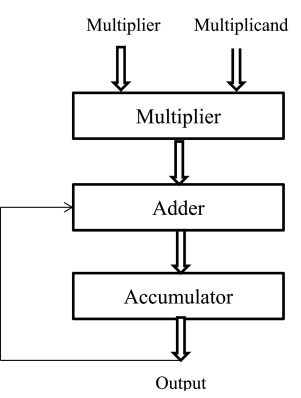
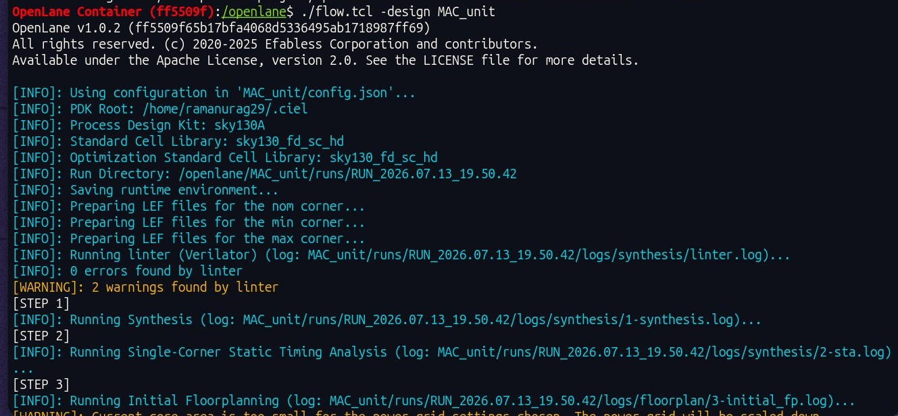
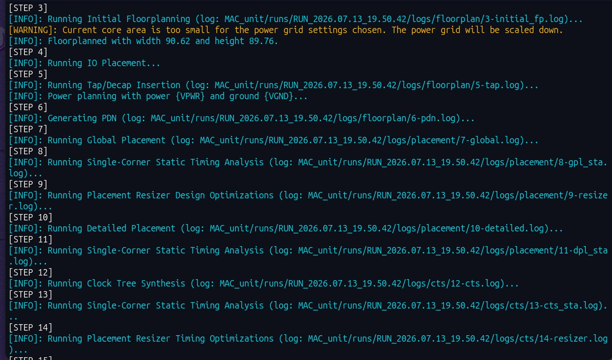
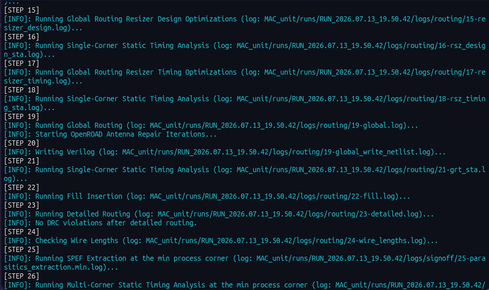
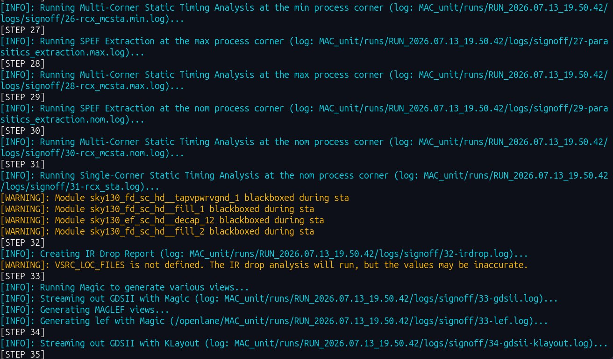
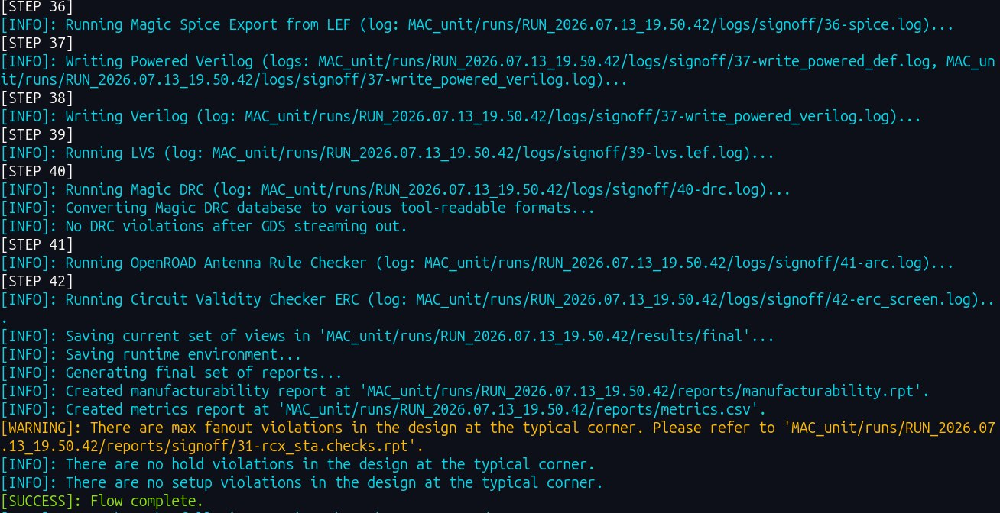
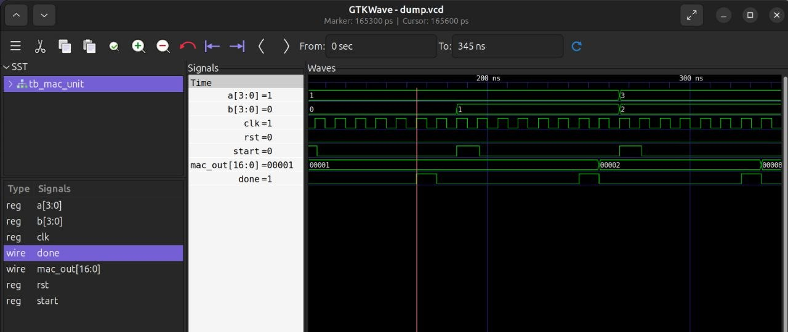
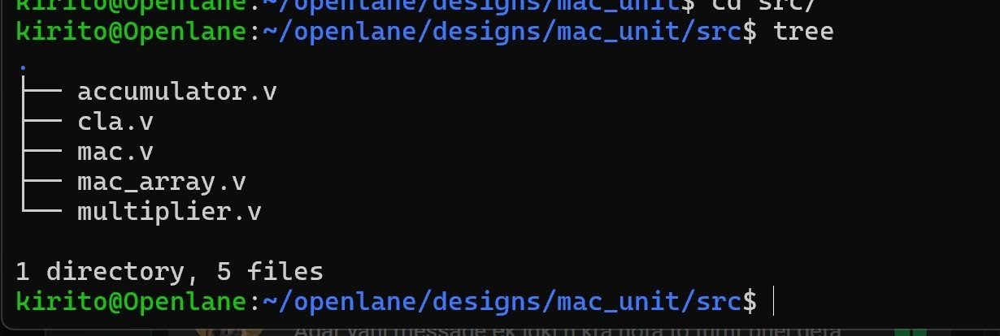
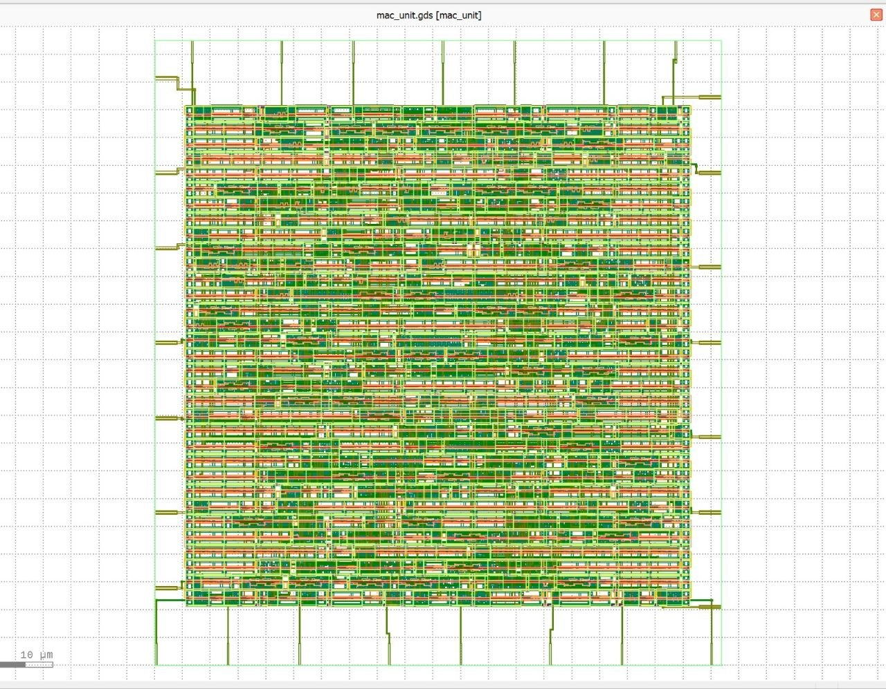

# RTL-to-GDSII Implementation of a Multiply-Accumulate (MAC) Unit

> Complete ASIC implementation of a synthesizable Multiply-Accumulate (MAC) Unit using **Verilog HDL**, **Cadence** for functional verification, and **OpenLane (Sky130 PDK)** for RTL-to-GDSII physical design.


---

# Table of Contents

- [Project Overview](#project-overview)
- [Features](#features)
- [Design Specifications](#design-specifications)
- [Repository Structure](#repository-structure)
- [MAC Architecture](#mac-architecture)
- [RTL Design](#rtl-design)
- [Functional Verification](#functional-verification)
- [Physical Design Flow](#physical-design-flow)
- [Results](#results)
- [Tools Used](#tools-used)
- [Future Improvements](#future-improvements)

---

# Project Overview

The **Multiply-Accumulate (MAC) Unit** is one of the most fundamental arithmetic blocks used in Digital Signal Processing (DSP), Artificial Intelligence (AI) accelerators, processors, image processing systems, and embedded applications.

This project presents the complete implementation of a synthesizable MAC Unit following a modern ASIC design methodology. The design was developed in **Verilog HDL**, functionally verified using **Cadence simulation tools**, and physically implemented using the **OpenLane RTL-to-GDSII flow** with the **Sky130 Process Design Kit (PDK)**.

The objective of this project is to demonstrate an end-to-end digital ASIC design flow, beginning with RTL design and verification, followed by synthesis, floorplanning, placement, clock tree synthesis (CTS), routing, timing verification, DRC analysis, and final GDSII generation.

---

# Features

- RTL implementation using Verilog HDL
- Modular MAC architecture
- Functional verification using Cadence
- Self-contained Verilog testbench
- RTL-to-GDSII implementation using OpenLane
- Logic synthesis
- Floorplanning
- Standard cell placement
- Clock Tree Synthesis (CTS)
- Global and Detailed Routing
- Static Timing Analysis (STA)
- Design Rule Checking (DRC)
- GDSII Layout Generation

---

# Design Specifications

| Parameter | Description |
|-----------|-------------|
| Design | Multiply-Accumulate (MAC) Unit |
| HDL | Verilog HDL |
| Verification | Cadence |
| Physical Design | OpenLane |
| PDK | Sky130 |
| Flow | RTL → GDSII |
| Output | GDSII Layout |

---

# Repository Structure

```
MAC-Unit-OpenLane
│
├── rtl/
├── testbench/
├── simulation/
│   ├── waveforms/
│   ├── reports/
│   └── screenshots/
│
├── openlane/
│   ├── gds/
│   ├── reports/
│   └── screenshots/
│
└── README.md
```

---

# MAC Architecture

The MAC unit performs the following operation:

```
Output = (A × B) + Accumulator
```

The design consists of the following major components:

- Multiplier
- Adder
- Accumulator Register
- Control Logic
- Output Register



---

# RTL Design

The RTL design was developed using **Verilog HDL** with a modular architecture to improve readability, scalability, and verification.

The design includes:

- MAC module
- Multiplier
- Adder
- Accumulator
- Control logic

The source files are available in the `rtl/` directory.

---

# Functional Verification

The functionality of the MAC Unit was verified using **Cadence** simulation tools.

The verification process included:

- Reset operation
- Clock synchronization
- Multiplication functionality
- Accumulation over multiple cycles
- Functional correctness verification

Waveform screenshots are available in the `simulation/waveforms/` directory.


---

# Physical Design Flow

After functional verification, the RTL design was implemented using the **OpenLane RTL-to-GDSII flow**.

The physical implementation consists of the following stages:

- RTL Synthesis
- Floorplanning
- Power Planning
- Standard Cell Placement
- Clock Tree Synthesis (CTS)
- Global Routing
- Detailed Routing
- Static Timing Analysis (STA)
- Design Rule Checking (DRC)
- GDSII Generation

Screenshots from each stage are available in the `openlane/screenshots/` directory.

### 1. OpenLane Flow Initialization

The OpenLane flow was configured using the Sky130A PDK and executed using the project configuration file.

<p align="center">

</p>

### 2. Floorplanning

During floorplanning, the die size, core area, IO placement, tap insertion, PDN generation, and initial placement preparation were completed.

<p align="center">


</p>

### 3. Placement and Clock Tree Synthesis

Standard cells were placed, timing optimization was performed, and Clock Tree Synthesis (CTS) generated a balanced clock network.

<p align="center">

</p>


### 4. Global and Detailed Routing

Global routing, detailed routing, antenna repair, and post-routing timing optimization were successfully completed.

<p align="center">

</p>

### 5. Signoff

The final design successfully completed:

- Multi-corner STA
- SPEF Extraction
- DRC
- LVS
- ERC
- GDSII Generation

No setup violations were reported, and no hold violations were observed at the typical process corner.

<p align="center">

</p>

# Functional Verification

The MAC Unit functionality was verified using a Verilog testbench and simulated before physical implementation.

<p align="center">

</p>

# RTL Source Files

The RTL implementation is divided into multiple modules.

<p align="center">

</p>

Modules include:

- mac.v
- multiplier.v
- accumulator.v
- cla.v
- mac_array.v

# Final GDSII Layout

The final routed layout generated using OpenLane.

<p align="center">

</p>


---

# Results
The final implementation successfully completed the RTL-to-GDSII flow using the Sky130 PDK. Functional verification was performed in Cadence, followed by physical implementation in OpenLane.

| Metric | Value |
|--------|------:|
| Standard Cells | **268** |
| Number of Wires | **257** |
| Chip Area | **2882.7648 µm²** |
| Worst Setup Slack | **+6.67 ns** |
| Worst Hold Slack | **+0.29 ns** |
| Total Negative Slack (TNS) | **0.00 ns** |
| Worst Negative Slack (WNS) | **0.00 ns** |


# Tools Used

| Tool | Purpose |
|------|----------|
| Verilog HDL | RTL Design |
| Cadence | Functional Verification |
| OpenLane | RTL-to-GDSII Flow |
| OpenROAD | Physical Design |
| Magic | Layout Visualization |
| Netgen | LVS Verification |
| Sky130 PDK | Standard Cell Library |

---
